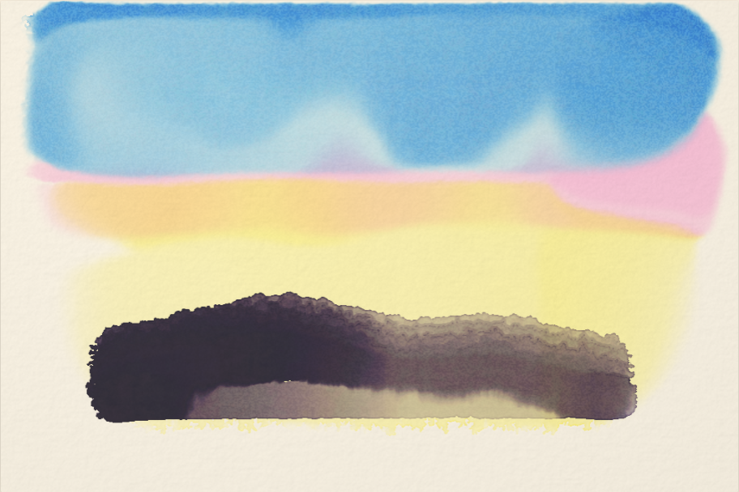
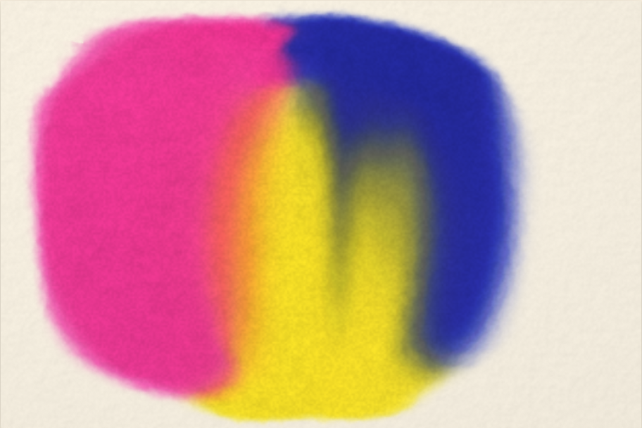
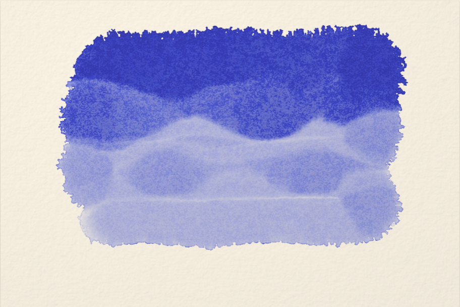
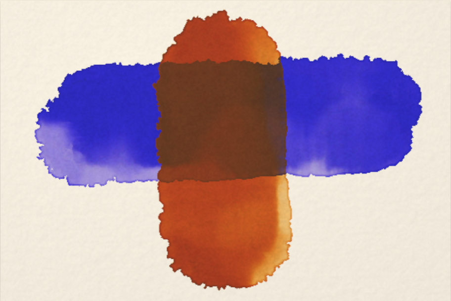
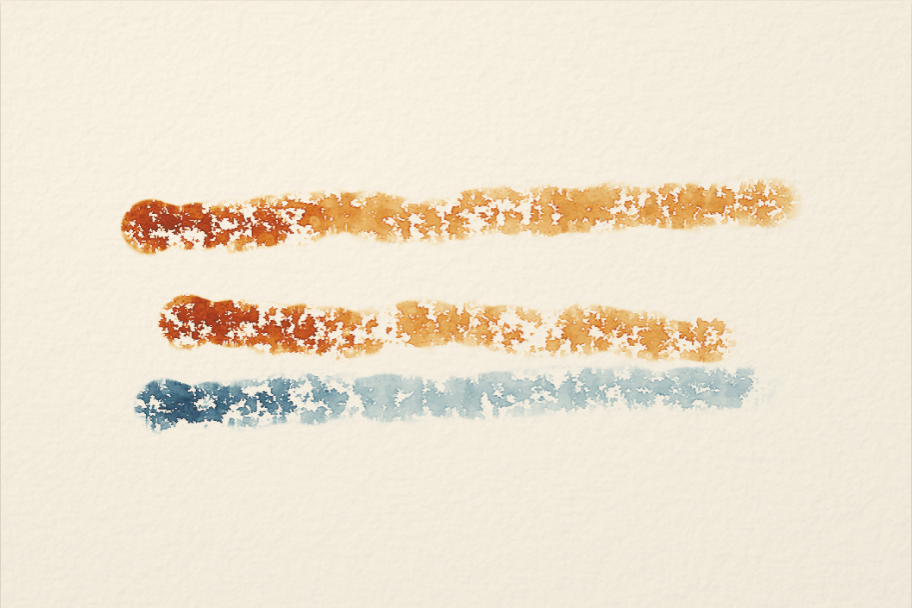
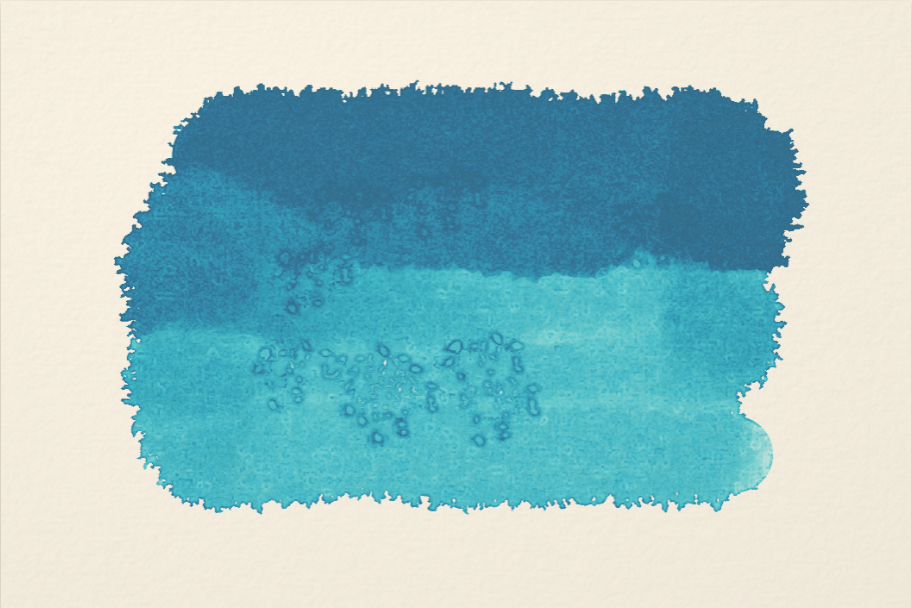

# Watercolor Lab

A real watercolor simulator in the browser. Water flows across the sheet,
pigment rides it, settles, granulates and stains, and the color you see is
computed with Kubelka-Munk optics from the absorption and scattering of real
pigments, not alpha blending. The fluid model is Curtis, Anderson, Seims,
Fleischer & Salesin, ["Computer-Generated
Watercolor"](https://grail.cs.washington.edu/projects/watercolor/) (SIGGRAPH
1997), running as WebGL2 fragment shaders.

**Try it: [watercolor.ryankm.com](https://watercolor.ryankm.com/)** on a
desktop browser with WebGL2 and a minute of playing with too much water.
EXP-040 in [the Lab](https://ryankm.com/lab).

Vanilla TypeScript and Vite, zero runtime dependencies, no framework, no
server, no analytics.



Every figure in this README is painted by the simulator itself, headlessly,
by `npm run figures`, the same brush model and physics a pointer drives, so
the pictures cannot drift from what the app actually does.

## Quickstart

Node 20 or newer.

```
npm install
npm run dev      # http://localhost:5173
```

## What the physics buys

Watercolor is a fluid problem before it is a rendering problem. The things
that make a wash read as *watercolor* (hard darkened edges, blooms, backruns,
granulation) are all transport effects: pigment being carried somewhere by
water and stranded there when the water leaves. So the simulator moves real
quantities around a grid and lets the look emerge:

- **Shallow-water layer**: standing water as a height field with a
  four-direction flux ("virtual pipes") between cells: unconditionally stable,
  exactly conserving, and the pigment-advection velocity falls out of the net
  flux. Surface tension holds a wash's edge until there is enough water behind
  it to invade dry paper, and the threshold rides the sheet's tooth, so
  boundaries creep along fibers instead of advancing as a level set.
- **Pigment layers**: a suspension that advects with the water plus a deposit
  that remembers, exchanging continuously: settling scaled by pigment density
  and paper valleys, lifting scaled by flow, staining and the tooth's peaks.
  Evaporation runs faster at the boundary of the wet region, and the induced
  inward flow carries suspended pigment to the drying front, the classic
  dark-rimmed watercolor edge is emergent, not painted on.
- **Capillary layer**: water inside the sheet, diffusing through the fibers,
  which is what lets a damp region keep creeping after the shine is gone
  (blooms, backruns).
- **Kubelka-Munk color**: each pigment is two spectra, absorption K and
  scattering S, derived from its masstone and opacity. A layer's reflectance
  and transmittance come from the two-flux solution; glazes composite as
  R₁ + T₁²R₂/(1−R₁R₂). Ultramarine over burnt sienna makes the dull olive it
  makes on paper, and a cadmium actually covers where a quinacridone never
  can. Mixing is linear in K and S, so two strokes meeting in the water mix
  physically for free.



## The paint box

36 real pigments (and a few traditional convenience mixtures), each declared
by masstone, opacity, granulation, staining and density: the numbers a tube
label prints. K and S are derived once from the masstone; the palette chips
are rendered through the same maths as the paint, so a chip is an honest
preview of a wash rather than a hex swatch the physics then disagrees with.

French ultramarine granulates into the tooth. Phthalo stains and will not
lift. Cerulean is dense and drops out of a moving wash early. The earths are
quiet; the quinacridones travel.




Hold any pan (or right-click it) for its card: the declared numbers as
meters (opacity, tinting strength, granulation, staining, settling), a
masstone-to-tint ramp painted by the same Kubelka-Munk maths as the pans, and
one sentence on handling composed from those same numbers, so the card can
never promise a behaviour the wash does not have.

## Techniques that work

Because the physics is real, the technique vocabulary transfers:

- **Mixing**: dip more than one pigment into the well (Mix, then tap pans)
  and the brush carries a physically mixed charge: K and S are linear in
  concentration, so the well does the same arithmetic the water does. Rinse
  empties it back to clean water.
- **Wet-on-wet**: wet the sheet with the water brush first; dropped color
  feathers and mingles.
- **Wet-on-dry**: paint on dry paper for hard, darkened edges.
- **Glazing**: dry the sheet (hairdryer button), then wash over.
- **Dry brush**: the starved brush only touches the tooth's peaks.
- **Salt**: sprinkle into a damp wash and let it dry: pale blooms with
  pushed-pigment rims.
- **Backruns**: push clean water into a drying wash and it crawls back in.
- **Lifting**: the lift tool is a thirsty damp scrub: it re-suspends
  deposit, drinks it off the sheet, and shoves the rest to the stroke's
  edges. Works on damp paint; staining pigments resist, earths give. Dried
  paint is cured and stays.
- **Backlight**: a lightbox view that shows what the light survives, through
  every layer and the sheet.
- **X-ray**: the simulation's own state, one field at a time: standing
  water, wetness, pigment in suspension, pigment settled, water inside the
  paper (salt in vermillion), and what has dried. Every pixel is one number
  from one texture on a fixed scale: an inspection, not an effect. Watch a
  wash in Water and Suspended while it dries and you can see the transport
  that makes the edge darken.
- **Alive modes**: Forever Wet turns evaporation off so the sheet stays
  workable; Rain drops clean water on the painting and lets the physics
  work it over.

On a phone the sheet turns portrait and the paint box stacks beneath it;
pressure from a stylus (Apple Pencil included) drives stroke width. Save
sheet dries the painting and keeps it in the browser for the next visit.




## Layout

```
src/
  paint/       Kubelka-Munk maths, the pigment library, mixing, brush kinematics
  engine/      WebGL2 plumbing, the simulation passes (GLSL), paper generation
  ui/          palette, mixing well, toolbox, studio wiring, site chrome
  data/        saved-sheet persistence (IndexedDB)
  tests/       headless checks for the maths
scripts/       scene scripts, headless figure generation
docs/          engineering log, README figures
```

## Tests

```
npm test
npm run typecheck
```

The suite pins the Kubelka-Munk implementation (physicality, thickness
monotonicity, the thick-layer masstone limit, Beer-Lambert in the
non-scattering limit, glazing order-dependence), the pigment derivation
(every pigment's K and S must round-trip its declared masstone), brush
kinematics (stamp spacing invariant under pointer-event batching; a bug the
suite caught in the first hour), and the paper generator's statistics.
`npm run build` runs `tsc` first and refuses to emit on a type error.

The GLSL side of the KM maths is a line-for-line transcription of the tested
TS (`src/paint/km.ts` carries both), and the render figures above are the
integration test: they are regenerated from the real shaders by
`npm run figures`.

## Design decisions

[`docs/session-log.md`](docs/session-log.md) is the build log: virtual pipes
over Curtis's velocity relaxation, summed K·c/S·c fields over per-pigment
textures, one folded dried-reflectance layer over a layer stack; each with
the alternative that was rejected and the reason, plus the visual tuning
rounds and what each round changed.

## Requirements

Any browser with WebGL2 and `EXT_color_buffer_float`: that is Chromium,
Firefox or Safari from the last several years, phones included. Everything runs
locally; nothing is uploaded, tracked or stored beyond your undo history,
which lives in GPU memory and dies with the tab.

## License

MIT; see [LICENSE](LICENSE). Built by [Ryan McCarty](https://ryankm.com).
